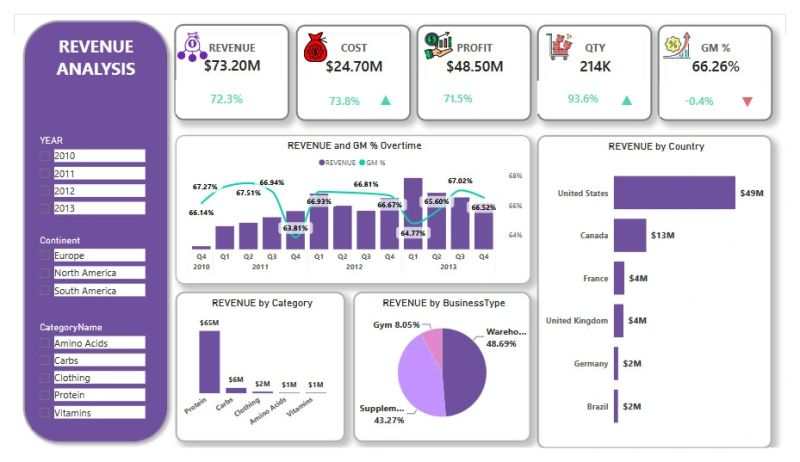
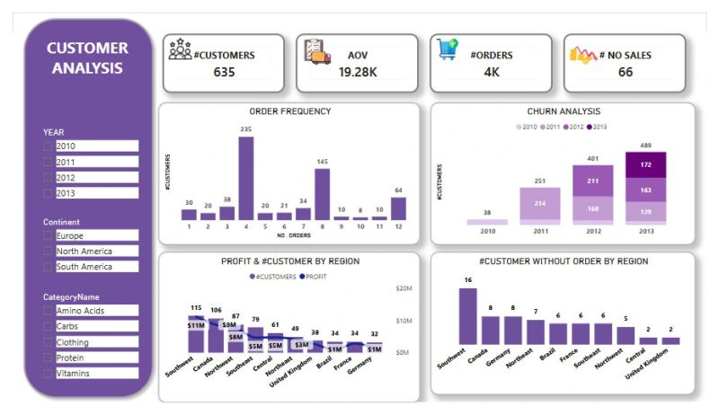
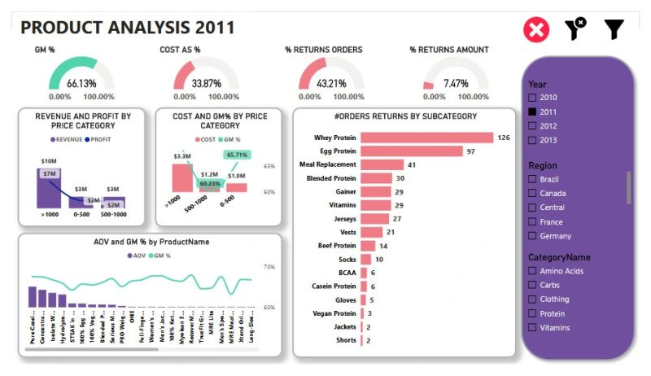

# Project-Portfolio-Management-Analytics

## 📊 Project Overview
This project is an end-to-end business intelligence solution designed to analyze **Sales Performance and Portfolio Health**. It bridges the gap between raw transactional data and strategic decision-making by implementing a robust ETL process, complex data modeling, and advanced analytical reporting.

## 🛠 Technical Stack & Tools
* **SQL**: Executed complex joins and data preparation queries to merge multi-source datasets.
* **Excel**: Performed initial data scrubbing, outlier detection, and structural data validation.
* **Power BI (DAX & Power Query)**: Built a comprehensive semantic model, implemented time-intelligence calculations, and designed interactive visual dashboards.

## 🧠 Data Engineering & ETL Process
The project followed a rigorous data workflow:
1. **Data Cleaning**: Handled null values, standardized formats, and reconciled discrepancies between Sales, Product, and Customer datasets.
2. **Relational Modeling**: Constructed a Star Schema model. Established 1:N relationships between `Sales Header` and `Sales Details`, and dimension tables (`Customers`, `Products`, `Geography`) to ensure data granularity.
3. **DAX Implementation**: Developed sophisticated measures including:
    - **AOV (Average Order Value)** to gauge customer spending patterns.
    - **Unique Customer Count** for churn and acquisition analysis.
    - **YTD & MTD Revenue** for temporal performance benchmarking.

## 🚀 Key Performance Insights
* **Sales Dynamics**: Multi-dimensional analysis showing revenue trends by region, product category, and customer business type.
* **Profitability Drivers**: Identified correlation between discount levels and net profit margins.
* **Operational Efficiency**: Streamlined data flow reducing report refresh times and enhancing dashboard interactivity.

## 📈 Dashboard Showcase
| Visualization Area | Focus Metrics |
| :--- | :--- |
| **Executive Summary** | Total Revenue, Profit Margin, YoY Growth |
| **Sales Performance** | Volume by Region, Product Subcategory Trends |
| **Customer Insights** | Unique Active Customers, Customer Segmentation |

*(Dashboard screenshots displayed below)*
| View 1 | View 2 | View 3 |
| :---: | :---: | :---: |
|  |  |  |

## 📑 Project Documentation
For technical deep-dives and executive summaries, download the reports below:
* [Sales_Dashboard_Analytical_Report.pdf](Sales_Dashboard_Analytical_Report.pdf) - Technical analysis documentation.
* [Sales_Dashboard_Executive_Analytical_Report.pdf](Sales_Dashboard_Executive_Analytical_Report.pdf) - Management-level insights.

---
*Developed by Mahmoud Atef | Data Analyst*
*Focusing on Data Engineering, BI, and Analytics.*
